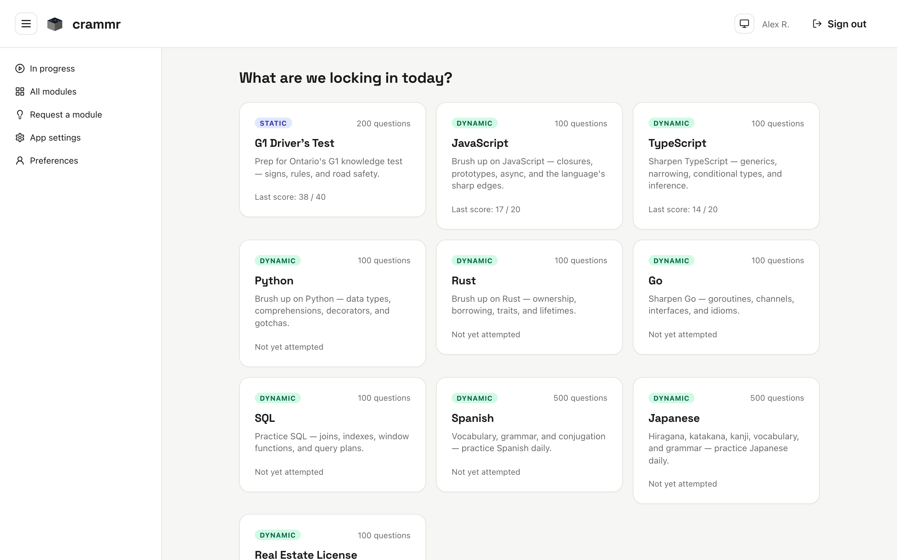
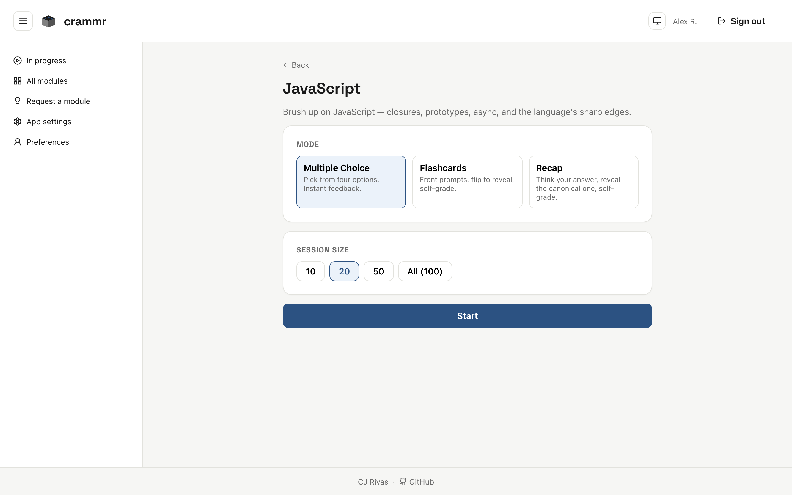
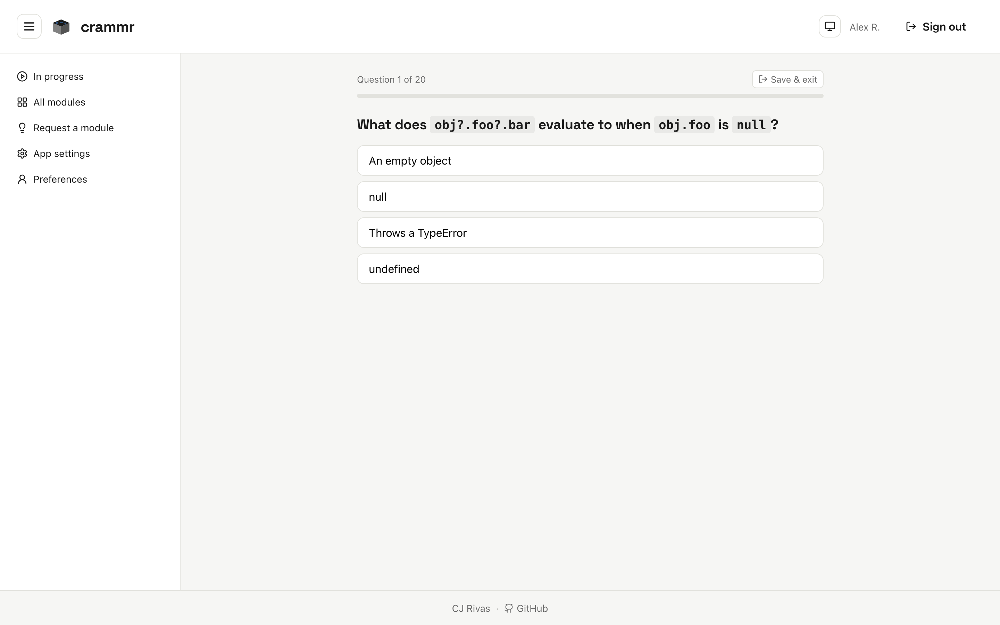

# crammr

Brush up on a skill or topic right before a test, so the material is fresh
in your mind. Pick a module, pick a mode, work through a quick session.

## Screenshots



The home page lists available modules with your last score on each.



Each module page lets you choose a mode (multiple choice, flashcards, recap)
and a session size before you start.



Quiz sessions track progress and let you save and exit at any time.

## Modules

18 modules across four categories:

- **Driving licensing** — G1 (Ontario)
- **Programming languages** — JavaScript, TypeScript, Python, C, C++, Java,
  C#, SQL, Go, Rust
- **Test prep** — Real Estate License
- **Languages** — English, Spanish, French, Japanese, Italian, Portuguese

Each module supports three **modes**:

- **Multiple choice** — pick from four options, instant feedback.
- **Flashcards** — front prompts, flip to reveal, self-grade.
- **Recap** — think your answer, reveal the canonical one, self-grade.

Dynamic modules let you choose a session size (10, 20, 50, or all); static
modules always use the full question bank.

## Stack

Bun · Vite · React + TypeScript · wouter · zustand · CSS modules ·
Supabase (Postgres + Auth + RLS) · Vitest.

## Setup

1. Install dependencies:
   ```
   bun install
   ```
2. Create a Supabase project at <https://supabase.com/dashboard>.
3. Create `.env.local` at the repo root with:
   ```
   VITE_SUPABASE_URL=https://xxxx.supabase.co
   VITE_SUPABASE_ANON_KEY=<anon key>
   SUPABASE_DB_URL=postgres://postgres.<ref>:<password>@<host>:5432/postgres
   ```
   `SUPABASE_DB_URL` comes from Dashboard → Project Settings → Database →
   Connection string (URI, with password). Only needed for `bun run db:apply`.
4. Apply migrations. Three options, pick one:
   - **`bun run db:apply`** — runs every `supabase/migrations/*.sql` via
     `psql` in sort order. Requires `psql` on PATH (`brew install libpq` and
     add to PATH, or `brew install postgresql`). Pass file paths to apply a
     subset, e.g. `bun run db:apply supabase/migrations/001_init.sql`.
   - **Supabase SQL Editor** — paste each file manually. Useful if you only
     want a subset of seeds; each `_seed_*.sql` is independent.
   - **`bun run db:push`** — uses the Supabase CLI. One-time setup:
     `brew install supabase/tap/supabase && supabase login && supabase link
     --project-ref <ref>`. Migration filenames must be renamed to
     `YYYYMMDDHHMMSS_name.sql` for the CLI to detect them.

   For a fresh project, apply `001_init.sql` and `005_module_requests.sql`
   plus any `_seed_*.sql` modules you want.
5. Run the dev server:
   ```
   bun run dev
   ```

## Scripts

- `bun run dev` — start Vite dev server
- `bun run build` — production build
- `bun run preview` — preview the production build
- `bun run typecheck` — `tsc --noEmit`
- `bun run lint` — ESLint
- `bun run test` — run Vitest once
- `bun run test:watch` — Vitest in watch mode
- `bun run check` — lint + typecheck + test
- `bun run db:apply` — apply `supabase/migrations/*.sql` via `psql` (uses
  `SUPABASE_DB_URL`)
- `bun run db:push` — apply migrations via the Supabase CLI (`supabase db
  push`); requires `supabase init` + `supabase link` first

## Regenerating screenshots

`scripts/capture-screenshots.ts` drives Chromium (Playwright) against the dev
server and writes PNGs to `docs/screenshots/`. It bypasses Supabase by
injecting a synthetic auth session and mocking PostgREST responses, so it
works without real credentials.

```
bun run dev                               # in one terminal
bun run scripts/capture-screenshots.ts    # in another
```
